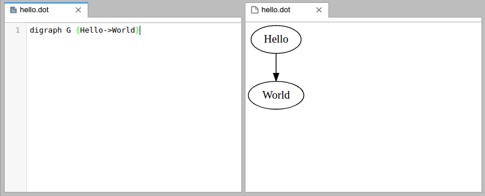

# jupyterlab_graphviz

A JupyterLab extension for viewing [graphviz](http://www.graphviz.org) data
files using [viz.js](https://github.com/mdaines/viz.js/).

`jupyterlab_graphviz` provides file renderers for files with the following
extensions:
- `.gv`
- `.neato`
- `.dot`

...and renderers for the following MIME types:
- `application/vnd.graphviz.neato`
- `application/vnd.graphviz`



To use the file viewer, right-click on a `.dot` file and choose the `dot`
viewer.


## Prerequisites
* [JupyterLab](https://github.com/jupyterlab/jupyterlab)


## Installation
```bash
jupyter labextension install jupyterlab_graphviz
```


## Development
### Prerequisites
- `jupyterlab>=0.32`
- `nodejs>=8`

For example, via `conda`:
```bash
conda install -c conda-forge jupyterlab nodejs
```

### Install dependencies
```bash
jlpm
```

### Build the extension
```bash
jlpm build
```

### Install into to your JupyterLab
```
jupyter labextension link .
```

### Rebuild once
To rebuild the package and the JupyterLab app:

```bash
jlpm build
jupyter lab build
```

### Develop continuously
```bash
jlpm watch
# and in another terminal
jupyter lab --watch
```

### Check and apply project style
```bash
jlpm lint
```

## TODO
* add tests
