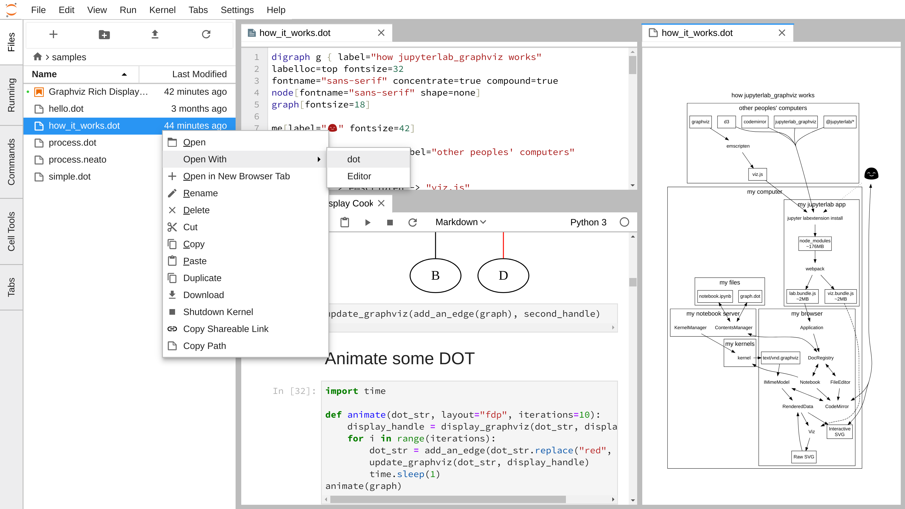

# jupyterlab graphviz

A JupyterLab extension for viewing [graphviz](http://www.graphviz.org) data.
files using the ###. A file renderer for files with `.dot` extensions and a mime renderer for the
`application/vnd.graphviz` mimetype is included. This extension uses the
[viz.js](https://github.com/mdaines/viz.js).



To use the file viewer, right-click on a `.dot` file and choose the `dot` viewer.

## Prerequisites

* JupyterLab

## Installation

```bash
jupyter labextension install jupyterlab_graphviz
```

## Development

For a development install (requires npm version 4 or later), do the following in the repository directory:

```bash
npm install
jupyter labextension link .
```

To rebuild the package and the JupyterLab app:

```bash
npm run build
jupyter lab build
```

## TODO

* support neato engine rendering with a specific MIME type
* add tests
* allow zooming in/out

